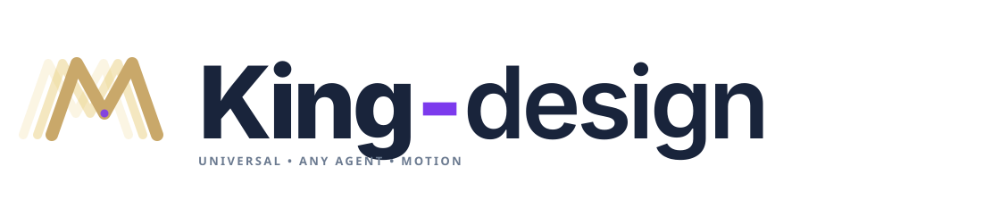

<p align="center">
  <picture>
    <source media="(prefers-color-scheme: dark)" srcset="docs/images/wordmark-dark.svg" />
    
  </picture>
</p>

<p align="center">
  حوّل منتجك أو موقعك أو فكرتك إلى فيلم موشن متكامل.<br />
  اختر الأسلوب. كيّف البرومبت. ولّد عبر Higgsfield.
</p>

<p align="center">
  <strong>يعمل على أي وكيل</strong> &nbsp; / &nbsp; 10 أساليب موشن &nbsp; / &nbsp; مهارة واحدة &nbsp; / &nbsp; Higgsfield MCP
</p>

<p align="center">
  <a href="README.md">🇺🇸 English</a> &nbsp;·&nbsp;
  <a href="https://mot1209.github.io/motion-design/"><strong>🌐 المعرض المباشر</strong></a> &nbsp;·&nbsp;
  <a href="install.sh">⚡ تثبيت بسطر واحد</a>
</p>

---

## مكتبة الموشن

من الواجهات الزجاجية إلى كشف المنتجات — ابدأ باتجاه بصري يمكنك مشاهدته فعلاً. **اضغط أي صورة لتشغيل الفيلم الأصلي.**

> المعرض المباشر: **https://mot1209.github.io/motion-design** — يعمل بدون تحميل

| الأسلوب | الوصف | الأفضل لـ |
|---|---|---|
| **Glass UI launch** | ألواح زجاجية تحمل المنتج من المشكلة إلى الحل | SaaS وأدوات AI |
| **Tropical product** | تصوير استوائي بطيء + مكونات معلقة | مشروبات وعطور |
| **Kinetic typography** | حروف تتحرك — عناوين وبطاقات وأيقونات | إعلانات ودورات |
| **Blueprint to building** | خطوط المخطط ترتفع وتصبح مبنى | عقارات وعمارة |
| **Exploded product** | تفكيك المنتج على محور واحد مع ماكرو | ساعات وسماعات |
| **Flat vector explainer** | شخصية مسطحة تتحول عبر 3 حالات | تطبيقات وخدمات |
| **+ 4 أساليب أخرى** | hyper-motion, hybrid 2D+3D, collage, footage | — |

## التثبيت السريع — أي وكيل

### ⚡ بسطر واحد (موصى به)

```sh
curl -fsSL https://raw.githubusercontent.com/MOT1209/motion-design/main/install.sh | bash
# مع تحديد الوكيل:
curl -fsSL https://raw.githubusercontent.com/MOT1209/motion-design/main/install.sh | bash -s -- --agent pi
```

### يدوي

```sh
git clone https://github.com/MOT1209/motion-design.git /tmp/motion-design
cp -r /tmp/motion-design/skills/motion-design ~/.claude/skills/motion-design  # Claude Code
cp -r /tmp/motion-design/skills/motion-design ~/.pi/agent/skills/motion-design  # Pi
cp -r /tmp/motion-design/skills/motion-design .cursor/skills/motion-design       # Cursor
```

راجع [دليل الإعداد الشامل](docs/setup-universal.md) لكل الوكلاء.

### ربط Higgsfield (للتوليد فقط)

```
https://mcp.higgsfield.ai/mcp
Claude: claude mcp add --transport http --scope user higgsfield https://mcp.higgsfield.ai/mcp
Pi:     pi mcp add higgsfield --transport http --url https://mcp.higgsfield.ai/mcp
Cursor: Settings → MCP → Add HTTP Server
```

بدون ربط؟ يمكنك التصفح وتصدير البرومبت واستخدامه في موقع Higgsfield مباشرة.

### اصنع أول فيلم

```
استخدم kinetic typography لإعلان 15 ثانية:
"ابنِ أول سير عمل AI خاص بك."
موسيقى + مؤثرات بدون سرد.
أرني البرومبت الكامل قبل التوليد.
```

## كيف يعمل

**اختر → كيّف → ولّد → راجع**

ينطلق من البرومبت الأصلي الكامل لأقرب مثال، ويحافظ على تقنيات الحركة الفعالة مع تكييف المشاهد والتوقيت لموضوعك. يُرسل الفيلم كـ **طلب واحد متكامل** عبر Higgsfield MCP.

راجع [SKILL.md](skills/motion-design/SKILL.md) للتفاصيل الكاملة.

## الترخيص

MIT — راجع [LICENSE](LICENSE) . البرومبتات الأصلية ومقاطع المعاينة ملك Higgsfield — راجع [ATTRIBUTION.md](ATTRIBUTION.md).

---

<p align="center">صنع بـ ❤️ بواسطة <a href="https://github.com/MOT1209">MOT1209</a> — يعمل على أي وكيل</p>
